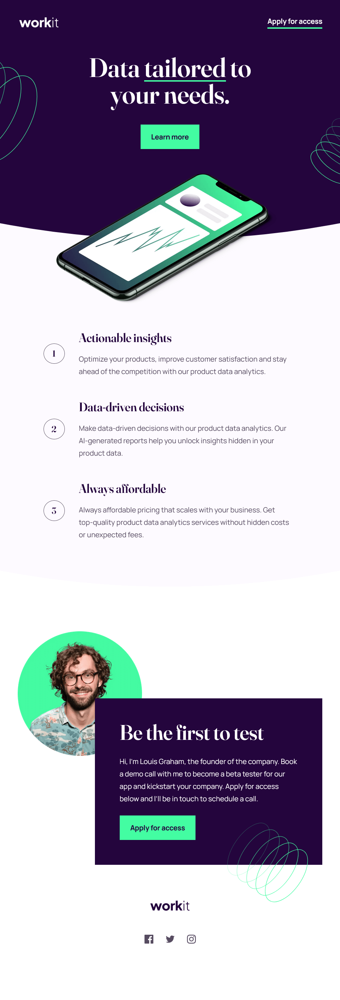
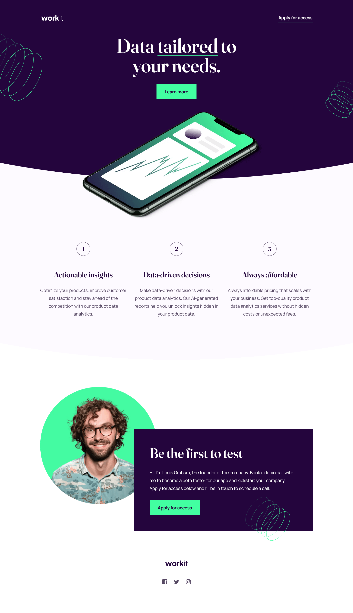

# Frontend Mentor - Workit landing page solution

This is a solution to the [Workit landing page challenge on Frontend Mentor](https://www.frontendmentor.io/challenges/workit-landing-page-2fYnyle5lu). Frontend Mentor challenges help you improve your coding skills by building realistic projects.

## Table of contents

- [Overview](#overview)
  - [The challenge](#the-challenge)
  - [Screenshot](#screenshot)
  - [Links](#links)
- [My process](#my-process)
  - [Built with](#built-with)
  - [What I learned](#what-i-learned)
  - [Useful resources](#useful-resources)
- [Author](#author)

## Overview

### The challenge

Users should be able to:

- View the optimal layout for the interface depending on their device's screen size
- See hover and focus states for all interactive elements on the page

### Screenshot

## Mobile

## Tablet

## Desktop

### Links

- Solution URL: [https://github.com/mihalymarcell86/workit-landing-page](https://github.com/mihalymarcell86/workit-landing-page)
- Live Site URL: [https://workit-landing-page-sigma.vercel.app/](https://workit-landing-page-sigma.vercel.app/)

## My process

### Built with

- Semantic HTML5 markup
- Sass, CSS custom properties, SVG
- Mobile-first workflow

### What I learned

In this project I learned using clip path by defining the curves in SVG, and making them responsive.

### Useful resources

- [StackOverflow - Responsive clip-path with inline SVG](https://stackoverflow.com/questions/28311741/responsive-clip-path-with-inline-svg)

## Author

- GitHub - [@mihalymarcell86](https://www.github.com/mihalymarcell86)
- Frontend Mentor - [@mihalymarcell86](https://www.frontendmentor.io/profile/mihalymarcell86)
